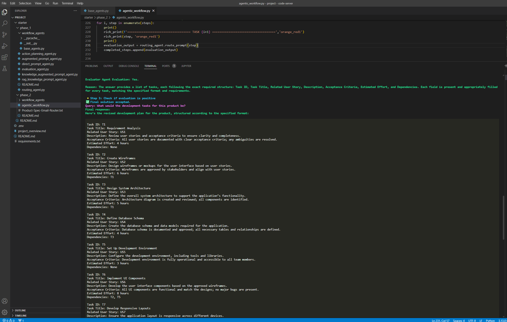
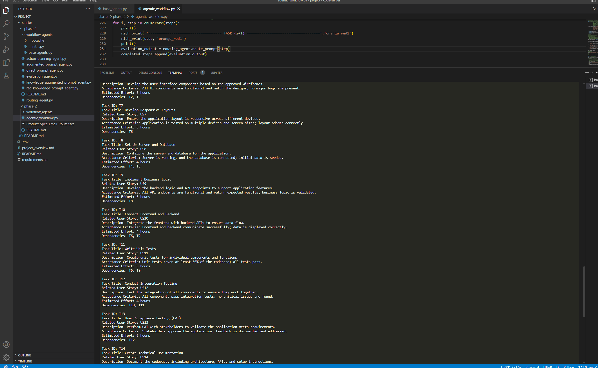
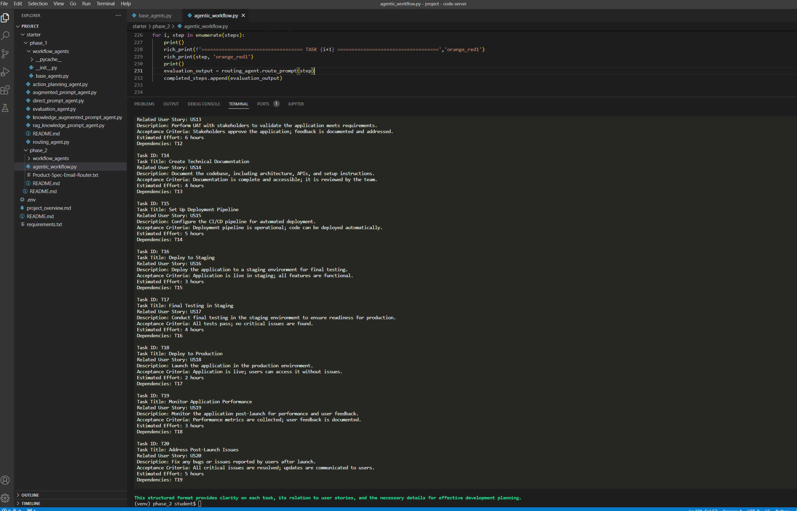

# Agentic Workflow Project

Python implementation of UDACITY's "agentic workflows" project, the second module of [Agentic AI nanodegree](https://www.udacity.com/course/agentic-ai--nd900).


## Project Overview
This project implements an **agentic workflow system** for automating and evaluating complex tasks using **specialized AI agents**. The system is designed to process product specifications (such as the Email Router product used in the project), create actionable steps, generate user stories, and iteratively evaluate and refine outputs using a modular, agent-based approach. The main entry point is `agentic_workflow.py`.

## Key Features
- Modular agent classes for planning, executing, evaluation, and routing
- Integration with OpenAI's GPT models for language understanding and generation
- Automated definition of user stories and engineering tasks from product specs
- Iterative evaluation (LLM-as-a-judge) and feedback loop for quality assurance
- Easy extensibility for new agent types and workflows

## Agent Descriptions
All agents are defined in `base_agents.py`:

### 1. **ActionPlanningAgent**
- **Purpose:** Creates actionable steps from a user prompt or product specification.
- **How it works:** Uses OpenAI GPT models and internal knowledge to parse prompts and return a bullet-point list of steps relevant to the product or task.

### 2. **KnowledgeAugmentedPromptAgent**
- **Purpose:** Generates responses using only a provided knowledge base and a persona.
- **How it works:** Ignores external context, relying solely on the injected knowledge to answer prompts, ensuring responses are grounded in the supplied information.

### 3. **EvaluationAgent**
- **Purpose:** Iteratively evaluates and refines the outputs of a worker agent (e.g., user story generation) against defined criteria.
- **How it works:** Runs a feedback loop where the worker agent's outputs are assessed and improved up to a maximum number of interactions, using a persona and evaluation criteria.

### 4. **RoutingAgent**
- **Purpose:** Selects the most appropriate agent to handle a task.
- **How it works:** Computes embeddings for user input and agent descriptions, using cosine similarity to route the prompt to the best-suited agent.


## Agentic Workflow (`agentic_workflow.py`)
The workflow typically follows these steps:
1. **Initialization:**
   - Loads environment variables (e.g., OpenAI API key from `.env`).
   - Reads the product specification from `Product-Spec-Email-Router.txt`.
2. **Agent Instantiation:**
   - Creates an `ActionPlanningAgent` with knowledge about how to extract stories, features, and tasks from the product spec.
   - Sets up three tailored `KnowledgeAugmentedPromptAgent` as worker agents:
        - a **product manager** to generate user stories from the spec.
        - a **program manager** to generate the features for the product.
        - a **development engineer** to generate the development tasks for the product.
   - Sets a `RoutingAgent` to select the most appropriate worker agent to handle each development task.
   - Wraps each knowledge agent with an `EvaluationAgent` to iteratively check and refine the generated outputs against a defined template/criteria specific to each agent.

3. **Execution:**
   - Worker Agents are called when selected via the `RoutingAgent` to process each development tasks, 
   - worker agents' outputs are evaluated by an EvaluationAgent through iterations (max 10), until the output meets the criteria (or the maximum number of iterations is reached).
   - The evaluation step ensures outputs meet quality standards and are iteratively improved.
   - The agentic workflow progresses through the development tasks until all tasks are completed.
   - The final output is a detailed development plan for the product, including user stories, features, and development tasks.

## Evaluation Mechanism
- **EvaluationAgent** assesses outputs (e.g., user stories) using explicit criteria, such as: `As a [type of user], I want [an action or feature] so that [benefit/value]`.
- Each Evaluation Agent provides feedback and requests refinements from the worker agent up to a maximum number of iterations, ensuring high-quality, criteria-aligned results. The agentic workflow moves to the next task only when the output meets the criteria.

## Dependencies
- Python 3.13+
- [OpenAI Python SDK](https://pypi.org/project/openai/)
- [pandas](https://pypi.org/project/pandas/)
- [numpy](https://pypi.org/project/numpy/)
- [python-dotenv](https://pypi.org/project/python-dotenv/)
- [rich](https://pypi.org/project/rich/) (for enhanced terminal output)

Install dependencies using [uv](https://github.com/astral-sh/uv):
```sh
uv add openai pandas numpy python-dotenv rich
```

## Setup
1. **Clone the repository and navigate to the project directory.**
2. **Create a `.env` file** with your OpenAI API key:
   ```
   OPENAI_API_KEY=your_openai_api_key_here
   ```
3. **Ensure `Product-Spec-Email-Router.txt` contains your product specification.**
4. **Install dependencies** as shown above.

## Usage Example
Below is an example of how to instantiate and use the agents in a workflow (see `agentic_workflow.py`):

```python
from dotenv import load_dotenv
from base_agents import ActionPlanningAgent, KnowledgeAugmentedPromptAgent, EvaluationAgent
import os

load_dotenv()
openai_api_key = os.getenv("OPENAI_API_KEY")

# Load product spec
with open('Product-Spec-Email-Router.txt', encoding='utf-8') as f:
    product_spec = f.read()

# Instantiate agents
action_planning_agent = ActionPlanningAgent(
    openai_api_key=openai_api_key,
    knowledge="...your knowledge here..."
)

product_manager_knowledge_agent = KnowledgeAugmentedPromptAgent(
    openai_api_key=openai_api_key,
    persona="You are a Product Manager...",
    knowledge=f"...knowledge and product spec..."
)

evaluation_agent = EvaluationAgent(
    openai_api_key=openai_api_key,
    persona="You are an evaluation agent...",
    evaluation_criteria="As a [type of user], I want [an action or feature] so that [benefit/value]",
    worker_agent=product_manager_knowledge_agent,
    max_interactions=10
)

# Run the evaluation workflow
result = evaluation_agent.evaluate("Generate user stories for the product spec")
print(result)
```

NOTE:
- I recommend using a more capable model for the EvaluationAgent. **Consider using gpt-4.1 for better results**. This can be changed in the base_agents.py class EvaluationAgent.
- This might also be valuable strategy for the ActionPlanningAgent.
- Worker agents can use gpt-4o-mini


## Sample Output





## File Structure
- `agentic_workflow.py` — Main project entry point and workflow demonstration
- `base_agents.py` — Definitions of all agent classes
- `Product-Spec-Email-Router.txt` — Example product specification
- `requirements.txt`, `uv.lock`, `pyproject.toml` — Dependency management
- `.env` — Environment variables (OpenAI API key)


---
For further details, see the code and comments in `agentic_workflow.py` and `base_agents.py`.
